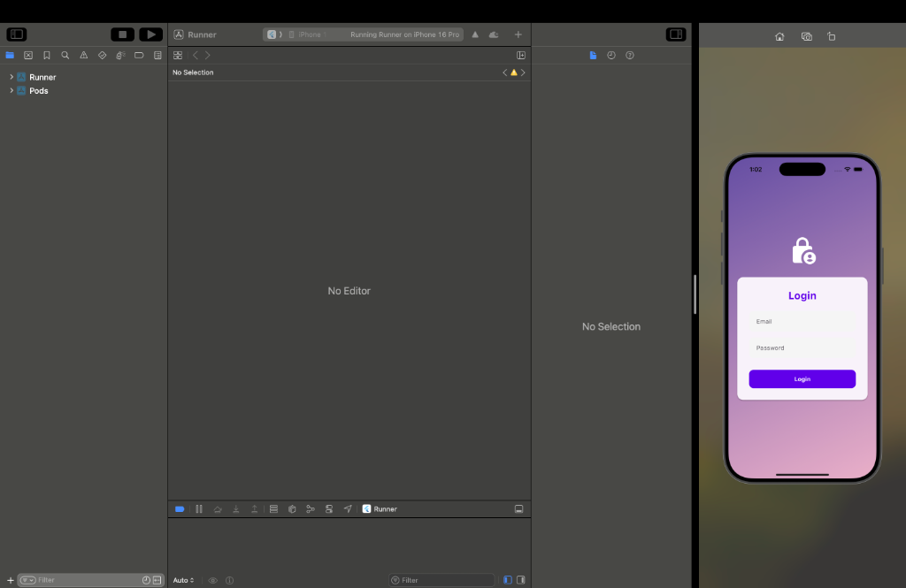
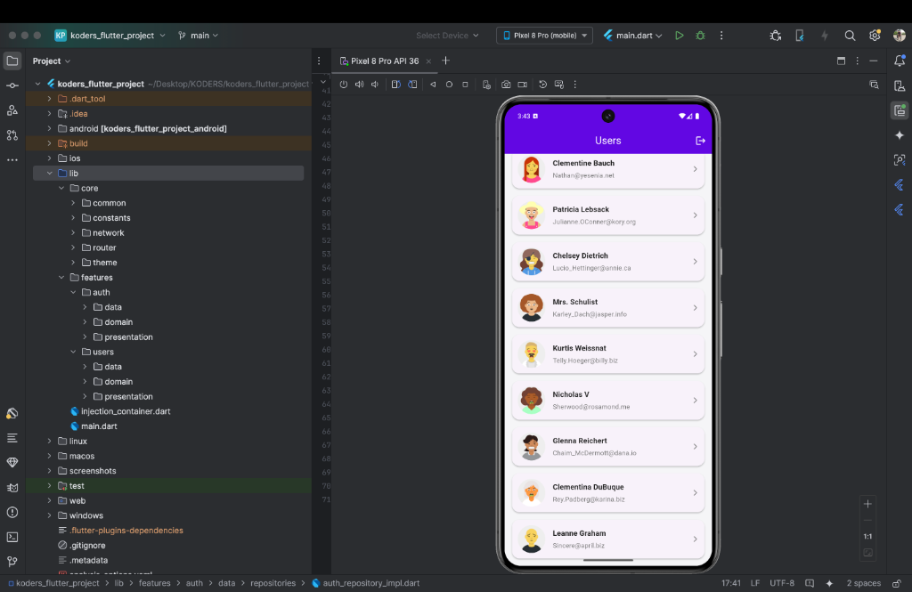
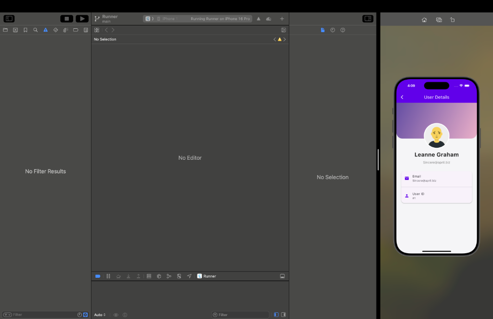

# Koders Flutter Assessment

A production-ready Flutter application demonstrating Clean Architecture, BLoC state management, and modern UI/UX principles.

## 📱 Screenshots

| Login Screen | User List | User Details |
|---|---|---|
|  |  |  |

## 🚀 Features

- **Authentication**: secure login flow with email validation and error handling.
- **User Management**:
  - Paginated user list with infinite scrolling.
  - Pull-to-refresh functionality.
  - Search/Filter (extensible).
  - Detailed user profile view.
- **Modern UI/UX**:
  - Material 3 Design with a custom purple/teal theme.
  - Shimmer loading effects (Skeleton screens).
  - Glassmorphism and gradient styles.
  - Interactive animations.
- **Architecture**:
  - **Clean Architecture*: Separation of concerns (Domain, Data, Presentation).
  - **BLoC**: Predictable state management using `flutter_bloc`.
  - **Dependency Injection**: `get_it` for service location.
  - **Networking**: `dio` with `retrofit` for type-safe API calls.

## 🛠 Tech Stack

- **Flutter SDK**: 3.x
- **State Management**: flutter_bloc
- **Navigation**: go_router
- **Networking**: dio, retrofit
- **Code Generation**: freezed, json_serializable
- **Images**: cached_network_image

## 🏗 Architecture Layout

The project follows the standard **Clean Architecture** structure:

```
lib/
├── core/                   # Core utilities, constants, theme, and network config
├── features/
│   ├── auth/               # Authentication Feature
│   │   ├── data/           # Repositories, Models, Data Sources
│   │   ├── domain/         # Entities, Usecases, Repository Interfaces
│   │   └── presentation/   # BLoCs, Screens, Widgets
│   └── users/              # User Management Feature
│       ├── data/
│       ├── domain/
│       └── presentation/
├── injection_container.dart # Dependency Injection Setup
└── main.dart               # Entry point
```

## ⚙️ Setup & Run

1.  **Clone the repository**:
    ```bash
    git clone https://github.com/anurag-chakravarti/KODERS.git
    cd KODERS
    ```

2.  **Install Dependencies**:
    ```bash
    flutter pub get
    ```

3.  **Run build_runner (optional, for code gen)**:
    ```bash
    dart run build_runner build --delete-conflicting-outputs
    ```

4.  **Run on iOS/Android**:
    ```bash
    flutter run
    ```

## 🧪 Testing

Run unit tests:
```bash
flutter test
```
